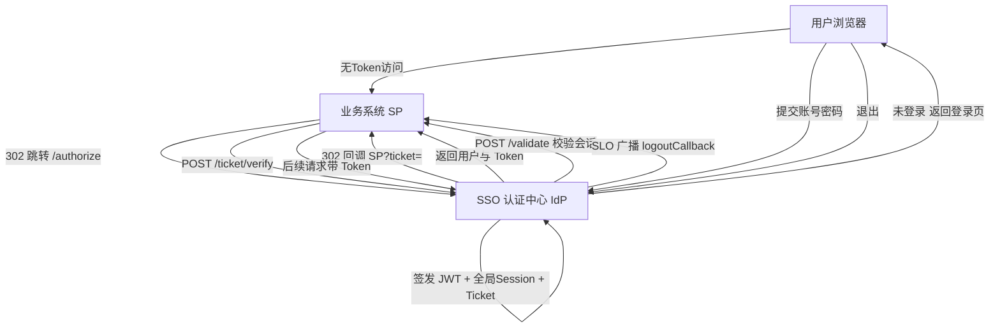

## 用户需求

基于 NestJS + TypeScript 开发完整的单点登录（SSO）系统，作为统一认证中心（IdP），提供标准 HTTP 接口并全量对接 Swagger / OpenAPI 接口文档。

## 产品概述

系统包含三端协作模型：用户端（浏览器）、应用系统（SP / 业务系统）、SSO 认证中心（IdP）。IdP 负责统一身份认证、全局会话管理、临时票据签发与校验、单点登出广播。所有对外接口均需通过 Swagger 注解生成在线接口文档。

## 核心功能

- 账号密码登录：校验身份后签发 JWT（Access + Refresh），并建立全局会话（Session）
- SSO 统一入口（/authorize）：检测全局会话，未登录重定向登录页，已登录签发一次一用 Ticket 并 302 回调业务系统
- Ticket 验证：业务系统用 Ticket 向 IdP 换取用户身份与 Token（票据一次一用、短时效防重放）
- Token 校验：业务系统将用户 Token 发往 IdP 校验全局会话合法性，实现二次访问免登录
- Token 刷新：Access Token 过期后用 Refresh Token 换取新令牌
- 单点登出（SLO）：一处退出，IdP 失效全局会话与全部票据，并广播通知所有已登录业务系统清除本地会话
- 业务系统（SP）管理：注册应用、配置回调地址与登出回调地址、查看应用列表
- 用户管理：注册账号、查询/更新当前用户信息（密码 bcrypt 加密）
- 接口文档：所有接口通过 @ApiTags/@ApiOperation/@ApiResponse 等生成 Swagger 文档
- 内置登录页与 SP 演示端，用于端到端验证完整流程

## 技术栈选择

- 框架：NestJS 10+（Node.js + TypeScript）
- 持久化：TypeORM + SQLite（默认，env 可切换 PostgreSQL/MySQL）
- 认证：@nestjs/jwt、@nestjs/passport、passport-jwt、bcryptjs
- 校验：class-validator、class-transformer
- 配置：@nestjs/config
- 文档：@nestjs/swagger（Swagger UI）
- 传输安全约定：HttpOnly Cookie 承载全局会话标识，Token 经 HTTPS 传输

## 实现方案

以「认证中心（IdP）」为核心，采用分层模块化架构（controller / service / entity）。通过 Session 实体维护全局会话状态，Ticket 实体实现一次一用临时票据，JWT 负责无状态 Token 校验。SP 通过标准接口与 IdP 交互，无需共享数据库，仅依赖约定的 HTTP 接口与密钥信任。

关键决策：

1. 全局会话服务端持久化（Session 表 + 会话标识存 HttpOnly Cookie），保证 SLO 可主动失效，优于纯无状态 JWT。
2. Ticket 采用随机串 + 短 TTL（如 60s）+ 已用标记，杜绝截获重放。
3. Access/Refresh 双 Token：Access 短过期（15m），Refresh 长过期（7d），降低泄露风险。
4. 复用 NestJS 标准守卫（JwtAuthGuard）与 DTO 校验，避免自定义框架，降低技术债。
5. Swagger 通过全局 setup + 每个接口装饰器实现全量文档，满足需求。

性能与可靠性：

- 会话/票据校验走主键或唯一索引查询，时间复杂度 O(1)。
- Ticket 与失效 Session 由定时任务或查询时惰性清理，控制表体积。
- 登录接口加基础限流（@nestjs/throttler）防爆破；密码仅存 bcrypt 哈希，不落明文。

## 实现要点

- 全局会话标识存 HttpOnly、SameSite=Lax Cookie；跨域场景通过 /authorize 302 跳转 + Ticket 解决，不依赖共享 Cookie。
- SLO 广播采用对各 SP 注册的 logoutCallbackUrl 顺序 POST 通知，单点失败不阻塞主登出（记录日志）。
- 复用统一响应结构与异常过滤器，所有错误经 HttpExceptionFilter 标准化输出，便于 Swagger 文档一致。
- 敏感配置（JWT 密钥、数据库、过期时间）全部走 .env，提供 .env.example。

## 架构设计



## 目录结构

本项目为全新工程，全部文件为 [NEW]。

```
nestjs-sso/
├── package.json                  # [NEW] 依赖与脚本（start/build/start:dev）
├── tsconfig.json                 # [NEW] TypeScript 配置
├── nest-cli.json                 # [NEW] Nest CLI 配置
├── .env.example                  # [NEW] 配置样例（JWT密钥/过期/数据库）
├── src/
│   ├── main.ts                   # [NEW] 入口：CORS、Swagger 装配、全局前缀 /api/v1、异常过滤器、限流
│   ├── app.module.ts             # [NEW] 根模块，聚合各功能模块与 TypeOrm/Config/Swagger 模块
│   ├── config/
│   │   └── configuration.ts      # [NEW] 读取 .env 的全局配置（JWT、过期、Cookie 域名等）
│   ├── common/
│   │   ├── decorators/
│   │   │   ├── current-user.decorator.ts  # [NEW] 提取当前用户
│   │   │   └── public.decorator.ts        # [NEW] 标记公开接口（跳过守卫）
│   │   ├── guards/
│   │   │   └── jwt-auth.guard.ts          # [NEW] JWT 鉴权守卫
│   │   ├── strategies/
│   │   │   └── jwt.strategy.ts            # [NEW] 解析并校验 JWT，注入用户信息
│   │   ├── filters/
│   │   │   └── http-exception.filter.ts   # [NEW] 统一异常响应结构
│   │   └── dto/
│   │       └── response.dto.ts            # [NEW] 统一响应封装
│   ├── modules/
│   │   ├── user/
│   │   │   ├── user.module.ts             # [NEW] 用户模块
│   │   │   ├── user.entity.ts             # [NEW] User 实体（username/passwordHash/email/status）
│   │   │   ├── user.service.ts            # [NEW] 注册、查用户、密码校验
│   │   │   ├── user.controller.ts         # [NEW] 注册、当前用户资料接口（Swagger）
│   │   │   └── dto/
│   │   │       ├── register.dto.ts        # [NEW] 注册入参校验
│   │   │       └── login.dto.ts           # [NEW] 登录入参校验
│   │   ├── auth/
│   │   │   ├── auth.module.ts             # [NEW] 认证模块（聚合 session/ticket service）
│   │   │   ├── auth.service.ts            # [NEW] 登录、签发JWT、刷新、登出、SLO广播
│   │   │   ├── auth.controller.ts         # [NEW] /authorize、/ticket/verify、/validate、/refresh、/logout（Swagger）
│   │   │   ├── session.entity.ts          # [NEW] 全局会话（sessionId/userId/expiresAt）
│   │   │   ├── ticket.entity.ts           # [NEW] 临时票据（code/appId/used/expiresAt）
│   │   │   ├── ticket.service.ts          # [NEW] 签发/消费一次一用票据
│   │   │   └── dto/
│   │   │       ├── authorize.dto.ts       # [NEW] appId/redirectUri/state
│   │   │       ├── ticket-verify.dto.ts   # [NEW] ticket/appId
│   │   │       └── validate.dto.ts        # [NEW] token
│   │   ├── app/  (业务系统 SP 管理)
│   │   │   ├── app.module.ts              # [NEW] 应用模块
│   │   │   ├── app.entity.ts              # [NEW] App 实体（name/appId/secret/redirectUri/logoutCallbackUrl）
│   │   │   ├── app.service.ts             # [NEW] 注册、查询、列表
│   │   │   ├── app.controller.ts          # [NEW] 应用增删查接口（Swagger）
│   │   │   └── dto/
│   │   │       └── create-app.dto.ts      # [NEW] 应用注册入参
│   │   └── demo-sp/  (内置演示端，验证流程)
│   │       ├── demo-sp.controller.ts      # [NEW] 模拟业务系统：受保护资源、登录页渲染、回调换票
│   │       └── views/
│   │           └── login.html             # [NEW] SSO 登录页（简洁表单）
│   └── test/
│       └── sso.e2e.spec.ts          # [NEW] 登录→authorize→ticket→validate→logout 流程 e2e 测试
└── README.md                        # [NEW] 启动说明、流程说明、接口清单、SP 接入指南
```

## 关键代码结构（接口契约）

```typescript
// 登录响应
interface LoginResponse {
  accessToken: string;
  refreshToken: string;
  expiresIn: number;
  user: { id: string; username: string; email?: string };
}

// Ticket 验证响应
interface TicketVerifyResponse {
  accessToken: string;
  expiresIn: number;
  user: { id: string; username: string };
}

// 统一错误结构（HttpExceptionFilter）
interface ApiError {
  code: number;
  message: string;
  timestamp: string;
  path: string;
}
```

## 设计风格

SSO 登录页采用简洁现代的居中卡片式布局（Minimalism + Material 轻量感），浅灰渐变背景、白色磨砂卡片、主色按钮带悬停微动效。页面仅含账号密码输入框与登录按钮，下方提示“统一身份认证”。整体克制专业，突出安全可信氛围。

## 页面区块

- 顶部：系统名「统一身份认证平台」与品牌标识，居中
- 中部：白色登录卡片，含用户名/密码输入框（带聚焦高亮）、登录按钮（主色渐变 + hover 上移）
- 底部：版权与 HTTPS 安全提示
- 错误态：字段下方红色提示文案，不刷新页面