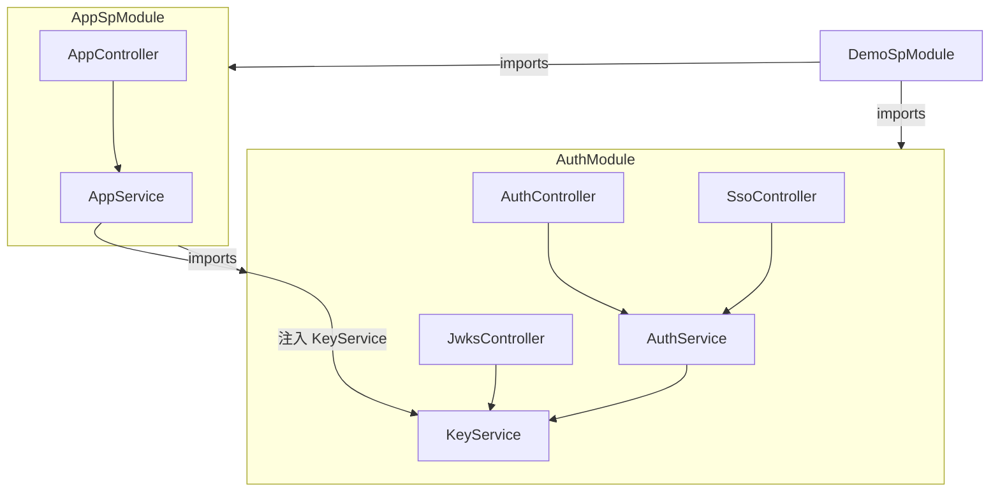
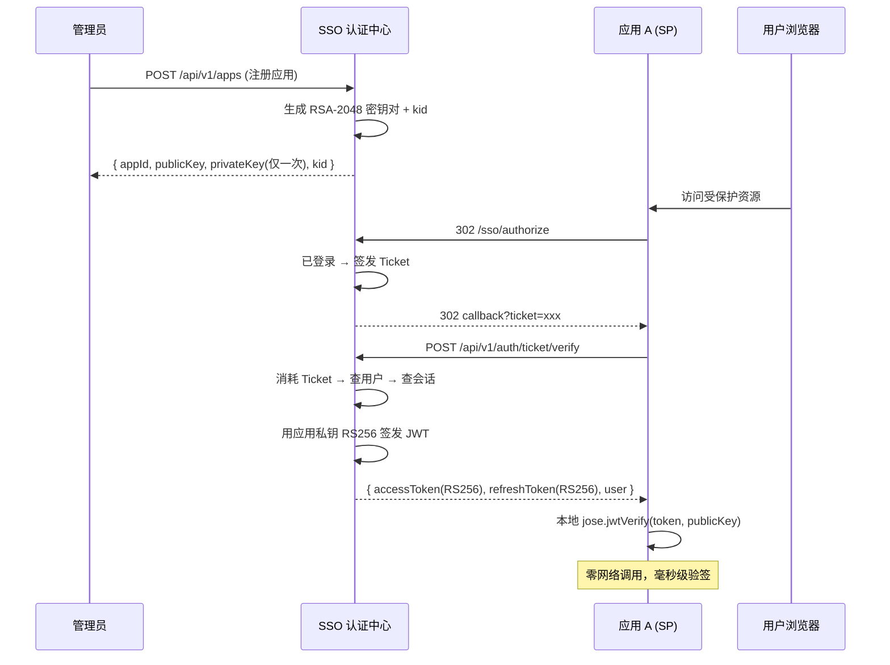

## 产品概述

优化 SSO 认证中心，为每个注册应用生成独立的 RSA-2048 非对称密钥对（RS256 签名），替代当前所有 SP 共享同一 HS256 密钥的方案。SP 凭公钥本地验签，私钥永不离开 SSO。同时新增 JWKS 标准端点供 SP 自动获取公钥，新增轻量会话探活接口以减少频繁的 validate 调用。

## 核心功能

- **创建应用时自动生成密钥对**：注册应用时生成 RSA-2048 密钥对（`publicKey`、`privateKey`）、唯一 `kid`，私钥仅在创建时返回一次
- **RS256 Token 签发**：`verifyTicket()` 和 SSO 登录返回给 SP 的 Token 使用应用专属私钥 RS256 签名，JWT payload 扩展 `email`、`status`、`appId`
- **JWKS 公开端点**：`GET /.well-known/jwks.json` 公开所有应用公钥，SP 运行时自动获取
- **双模式 Token 校验**：`/auth/validate` 同时支持旧 HS256（SSO 内部）和新 RS256（SP Token），按 JWT header `alg` 自动分发
- **lightweight 会话探活**：`POST /api/v1/auth/session/ping` 仅校验会话有效性，不查用户，供 SP 定时调用
- **向后兼容**：SSO 内部 Bearer Token（JwtStrategy）保持 HS256 不变；应用列表/详情不暴露私钥

## 技术栈

- 运行时：Node.js + NestJS 10 + TypeScript
- ORM：TypeORM（SQLite / PostgreSQL / MySQL）
- 非对称密钥：Node.js `crypto.generateKeyPairSync('rsa', { modulusLength: 2048 })`
- JWT 签发/校验：`jsonwebtoken`（HS256 兼容部分） + `jose`（RS256，可选）
- API 文档：Swagger（`@nestjs/swagger`）

## 实现方案

### 架构设计

```
                        SSO 内部 API（不变）
                    HS256 + 全局 JWT_SECRET
                              │
      ┌───────────────────────┼───────────────────────┐
      │                       │                       │
  ┌───▼────┐           ┌──────▼──────┐          ┌─────▼─────┐
  │ 登录   │           │ Ticket 换票  │          │ Refresh   │
  │ HS256  │           │ RS256 + 私钥 │          │ RS256     │
  └────────┘           └─────────────┘          └───────────┘
                               │
                    ┌──────────▼──────────┐
                    │   应用 A 密钥对      │
                    │   privateKey + kid  │──── 签名 JWT
                    │   publicKey → JWKS  │
                    └─────────────────────┘
                               │
              ┌────────────────┼────────────────┐
              ▼                ▼                ▼
      应用A公钥验签      应用B公钥验签      JWKS端点
     (本地, 零网络)     (本地, 零网络)   /.well-known/jwks.json
```

### 数据模型变更

**App Entity 新增字段：**

| 字段 | 类型 | 说明 |
| --- | --- | --- |
| `publicKey` | text | RSA 公钥，PEM 格式，通过 JWKS 公开 |
| `privateKey` | text | RSA 私钥，PEM 格式，仅创建时返回一次 |
| `kid` | string (unique) | Key ID，格式 `app_{appId}_{timestamp}`，JWT header 使用 |


### 模块关系



### 核心流程

**创建应用 → 签发 RS256 Token → SP 本地验签：**



### 密钥生命周期

```
创建应用 ──▶ generateKeyPairSync('rsa', 2048)
              ├── kid = "app_{appId}_{timestamp}"
              ├── publicKey → 存 App Entity → JWKS 端点公开
              └── privateKey → 存 App Entity → 仅 create 响应返回

删除应用 ──▶ 同时移除密钥对 → JWKS 自动不再包含该公钥

密钥轮换 ──▶ 可选：重新生成密钥对 → 保留旧 key 15min → 切换签发新 key
```

## 实现细节

### 目录结构

```
src/
├── main.ts                                  # [MODIFY] 排除 .well-known 路径
├── modules/
│   ├── app/
│   │   ├── app.entity.ts                    # [MODIFY] 新增 publicKey, privateKey, kid
│   │   ├── app.service.ts                   # [MODIFY] create()/ensureApp() 生成密钥对
│   │   ├── app.controller.ts                # [MODIFY] 列表/详情 脱敏 privateKey
│   │   ├── app-sp.module.ts                 # [MODIFY] imports AuthModule (获取 KeyService)
│   ├── auth/
│   │   ├── key.service.ts                   # [NEW] 密钥生成、JWKS 构造、私钥查询
│   │   ├── jwks.controller.ts               # [NEW] GET /.well-known/jwks.json
│   │   ├── auth.service.ts                  # [MODIFY] RS256 签发、双模式验证、pingSession
│   │   ├── auth.controller.ts               # [MODIFY] 新增 /session/ping 端点
│   │   ├── auth.module.ts                   # [MODIFY] 注册 KeyService/JwksController，exports
│   │   ├── dto/
│   │   │   └── session-ping.dto.ts          # [NEW] Ping 请求 DTO
```

### 关键代码结构

**KeyService 接口：**

```typescript
// src/modules/auth/key.service.ts
export interface AppKeyPair {
  publicKey: string;      // PEM 格式
  privateKey: string;     // PEM 格式，仅 SSO 内部
  kid: string;            // Key ID
}

export class KeyService {
  generateKeyPair(appId: string): AppKeyPair;
  getPrivateKey(appId: string): Promise<string | null>;
  getJwks(): { keys: JsonWebKey[] };  // 构造 JWKS
}
```

**issueTokens 签名改写：**

```typescript
// auth.service.ts
private async issueTokens(
  user: User,
  sessionId: string,
  appId?: string,         // 有 appId → RS256；无 → HS256
): Promise<TokenPair> {
  const payload = {
    sub: user.id, username: user.username,
    email: user.email, status: user.status,
    sessionId, ...(appId ? { appId } : {}),
  };

  if (appId) {
    const { privateKey, kid } = await this.keyService.getPrivateKeyWithKid(appId);
    return { accessToken: jwt.sign(payload, privateKey, { algorithm: 'RS256', keyid: kid, ... }) };
  }
  // 回退 HS256
  return { accessToken: this.jwt.sign(payload) };
}
```

**validateToken 双模式分发：**

```typescript
async validateToken(dto: ValidateDto) {
  const decoded = jwt.decode(dto.token, { complete: true });
  if (!decoded) return { valid: false };

  if (decoded.header.alg === 'RS256') {
    const { kid } = decoded.header;
    const publicKey = await keyService.getPublicKeyByKid(kid);
    payload = jwt.verify(dto.token, publicKey, { algorithms: ['RS256'] });
  } else {
    payload = this.jwt.verify(dto.token);  // HS256
  }
  // ... 后续查 session + 用户
}
```

### 向后兼容策略

- SSO 内部 Bearer Token（`JwtStrategy`）全程不变，仍用 `passport-jwt` + HS256
- `login()` 返回的 Token 保持 HS256（用于 SSO API 鉴权）
- `verifyTicket()` 返回的 Token 改为 RS256（SP 专用）
- `refresh()` 按 token header alg 自动判断，同时支持 HS256 和 RS256
- `logoutByToken()` 仅 decode 不解密，HS256/RS256 均可

### 性能注意

- RSA-2048 生成在应用创建时一次性完成，不影响 Token 签发性能
- RS256 签名比 HS256 慢约 10-20 倍（~1-2ms vs ~0.05ms），但在 Token 签发场景（login/verifyTicket/refresh）完全可以接受
- JWKS 端点可加短时缓存（5 分钟），避免每次验签都查库
- `/session/ping` 只需一次 `sessions.findValid()`，比原来的 `validate`（验签+查session+查user）轻量得多